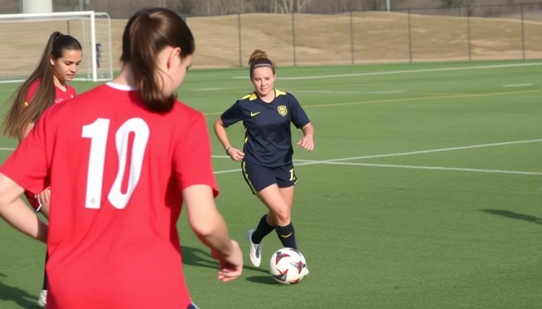

# Analysis of Workloads and ACWR in Sports Sessions

## Overview

This project analyzes workloads and the Acute:Chronic Workload Ratio (ACWR) in sports sessions, based on the 2019 season of the University of Michigan women's soccer team.

## Table of Contents

1. [Introduction](#introduction)
2. [Methodology](#methodology)
3. [Results](#results)
4. [Conclusions](#conclusions)
5. [License](#license)

## Introduction

This report evaluates the ACWR, a key indicator in training load management and injury prevention, using data from sports performance monitoring devices.

## Methodology

- Data collected from Catapult Sports devices.
- ACWR evaluated using 7-day acute and 28-day chronic windows, and 3-day acute and 21-day chronic windows.

## Results

[Book english](https://github.com/ale-uy/Acute_Chronic_Workload_Ratio/blob/main/Book_english.pdf)

[Book espanol](https://github.com/ale-uy/Acute_Chronic_Workload_Ratio/blob/main/Book_espanol.pdf)

## Conclusions

The ACWR analysis provides valuable insights into players' workloads, helping to optimize performance and prevent injuries.

## License

[Mit License](https://github.com/ale-uy/Acute_Chronic_Workload_Ratio/blob/main/LICENSE)
